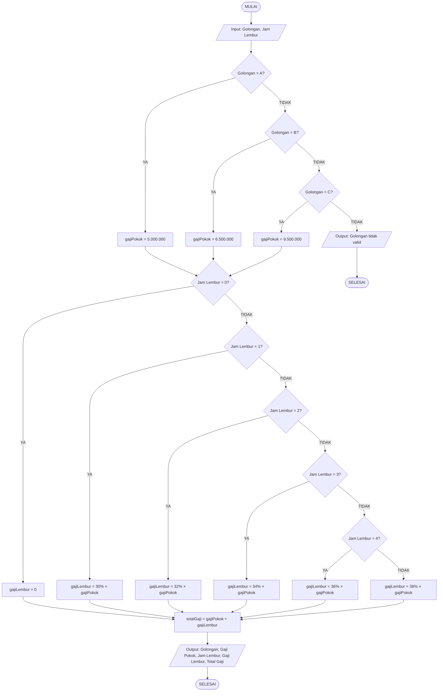

# Soal 2: Flowchart dan Pseudocode Penghitungan Gaji Karyawan

---

## Deskripsi Masalah

Sebuah perusahaan memiliki tiga golongan karyawan dengan gaji pokok:
- **Golongan A**: Gaji Pokok = Rp 5.000.000
- **Golongan B**: Gaji Pokok = Rp 6.500.000
- **Golongan C**: Gaji Pokok = Rp 9.500.000

Ketentuan Gaji Lembur:
| Jam Lembur | Persentase Lembur |
|------------|-------------------|
| 1 Jam      | 30% dari Gaji Pokok |
| 2 Jam      | 32% dari Gaji Pokok |
| 3 Jam      | 34% dari Gaji Pokok |
| 4 Jam      | 36% dari Gaji Pokok |
| >= 5 Jam   | 38% dari Gaji Pokok |

**Input**: Golongan Karyawan, Jam Lembur  
**Output**: Total Penghasilan = Gaji Pokok + Gaji Lembur

---

## A. Pseudocode

```
PROGRAM HitungGajiKaryawan

DEKLARASI:
    golongan    : STRING
    jamLembur   : INTEGER
    gajiPokok   : REAL
    gajiLembur  : REAL
    totalGaji   : REAL
    persenLembur: REAL

MULAI

    // --- INPUT ---
    TULIS "Masukkan Golongan Karyawan (A / B / C): "
    BACA golongan

    TULIS "Masukkan Jam Lembur (0 jika tidak lembur): "
    BACA jamLembur

    // --- PROSES: Tentukan Gaji Pokok ---
    IF golongan = "A" MAKA
        gajiPokok ← 5000000
    ELSE IF golongan = "B" MAKA
        gajiPokok ← 6500000
    ELSE IF golongan = "C" MAKA
        gajiPokok ← 9500000
    ELSE
        TULIS "Golongan tidak valid!"
        KELUAR
    RETURN

    // --- PROSES: Tentukan Persentase & Gaji Lembur ---
    IF jamLembur = 0 MAKA
        gajiLembur ← 0
    ELSE IF jamLembur = 1 MAKA
        persenLembur ← 0.30
        gajiLembur   ← persenLembur × gajiPokok
    ELSE IF jamLembur = 2 MAKA
        persenLembur ← 0.32
        gajiLembur   ← persenLembur × gajiPokok
    ELSE IF jamLembur = 3 MAKA
        persenLembur ← 0.34
        gajiLembur   ← persenLembur × gajiPokok
    ELSE IF jamLembur = 4 MAKA
        persenLembur ← 0.36
        gajiLembur   ← persenLembur × gajiPokok
    ELSE  // jamLembur >= 5
        persenLembur ← 0.38
        gajiLembur   ← persenLembur × gajiPokok
    RETURN

    // --- PROSES: Hitung Total ---
    totalGaji ← gajiPokok + gajiLembur

    // --- OUTPUT ---
    TULIS "=============================="
    TULIS "Golongan    : " + golongan
    TULIS "Gaji Pokok  : Rp " + gajiPokok
    TULIS "Jam Lembur  : " + jamLembur + " Jam"
    TULIS "Gaji Lembur : Rp " + gajiLembur
    TULIS "------------------------------"
    TULIS "Total Gaji  : Rp " + totalGaji
    TULIS "=============================="

SELESAI
```

---

## B. Flowchart

```
                    ┌─────────────────┐
                    │      MULAI      │
                    └────────┬────────┘
                             │
                    ┌────────▼────────┐
                    │  Input:         │
                    │  - Golongan     │
                    │  - Jam Lembur   │
                    └────────┬────────┘
                             │
              ┌──────────────▼──────────────┐
              │   Golongan = "A" ?          │
              └───────┬─────────┬───────────┘
                  YA  │         │ TIDAK
         ┌────────────▼┐   ┌────▼──────────────────┐
         │gajiPokok =  │   │   Golongan = "B" ?    │
         │Rp 5.000.000 │   └────┬─────────┬─────────┘
         └────────────┬┘    YA  │         │ TIDAK
                      │  ┌──────▼──┐  ┌───▼──────────────┐
                      │  │gajiPokok│  │ Golongan = "C" ? │
                      │  │= Rp 6,5 │  └──┬────────┬───────┘
                      │  │  Juta   │  YA │        │ TIDAK
                      │  └──────┬──┘ ┌───▼──────┐ ┌────────────┐
                      │         │    │gajiPokok │ │  OUTPUT:   │
                      │         │    │= Rp 9,5  │ │  "Golongan │
                      │         │    │  Juta    │ │  tidak     │
                      │         │    └───┬──────┘ │  valid"    │
                      │         │        │        └─────┬──────┘
                      └────┬────┘        │              │
                           │             │              ▼
                           └──────┬──────┘           SELESAI
                                  │
               ┌──────────────────▼──────────────────┐
               │          Jam Lembur = 0 ?            │
               └──────────┬──────────────┬────────────┘
                       YA │              │ TIDAK
               ┌──────────▼───┐   ┌──────▼────────────────┐
               │gajiLembur = 0│   │   Jam Lembur = 1 ?    │
               └──────────┬───┘   └───┬───────────┬────────┘
                          │       YA  │            │ TIDAK
                          │  ┌────────▼──┐  ┌──────▼───────────────┐
                          │  │persen=30% │  │  Jam Lembur = 2 ?   │
                          │  │lembur=    │  └───┬──────────┬────────┘
                          │  │30%×pokok  │  YA  │          │ TIDAK
                          │  └────────┬──┘ ┌────▼────┐ ┌───▼──────────────┐
                          │           │    │persen=  │ │ Jam Lembur = 3 ? │
                          │           │    │32%      │ └──┬────────┬────────┘
                          │           │    │lembur=  │ YA │        │ TIDAK
                          │           │    │32%×pokok│ ┌──▼──┐ ┌───▼─────────────┐
                          │           │    └────┬────┘ │35%= │ │ Jam Lembur = 4?│
                          │           │         │      │34%  │ └──┬──────┬────────┘
                          │           │         │      │lemb=│ YA │      │ TIDAK
                          │           │         │      │34%× │ ┌──▼─┐  ┌──▼──────┐
                          │           │         │      │pokok│ │36% │  │persen=  │
                          │           │         │      └──┬──┘ │×pkk│  │38%      │
                          │           │         │         │    └──┬─┘  │lembur=  │
                          │           │         │         │       │    │38%×pokok│
                          │           │         │         │       │    └───┬─────┘
                          └─────┬─────┘         │         │       │        │
                                └───────────────┴─────────┴───────┴────────┘
                                                          │
                                              ┌───────────▼──────────┐
                                              │  totalGaji =         │
                                              │  gajiPokok +         │
                                              │  gajiLembur          │
                                              └───────────┬──────────┘
                                                          │
                                              ┌───────────▼──────────┐
                                              │  Output:             │
                                              │  - Golongan          │
                                              │  - Gaji Pokok        │
                                              │  - Jam Lembur        │
                                              │  - Gaji Lembur       │
                                              │  - Total Gaji        │
                                              └───────────┬──────────┘
                                                          │
                                              ┌───────────▼──────────┐
                                              │        SELESAI       │
                                              └──────────────────────┘
```

---

## C. Flowchart (Format Mermaid)



---

## D. Contoh Perhitungan

**Contoh 1:**
- Golongan: B, Jam Lembur: 3 Jam
- Gaji Pokok = Rp 6.500.000
- Gaji Lembur = 34% × 6.500.000 = Rp 2.210.000
- **Total Gaji = Rp 8.710.000**

**Contoh 2:**
- Golongan: A, Jam Lembur: 0 Jam
- Gaji Pokok = Rp 5.000.000
- Gaji Lembur = Rp 0
- **Total Gaji = Rp 5.000.000**

**Contoh 3:**
- Golongan: C, Jam Lembur: 5 Jam
- Gaji Pokok = Rp 9.500.000
- Gaji Lembur = 38% × 9.500.000 = Rp 3.610.000
- **Total Gaji = Rp 13.110.000**
